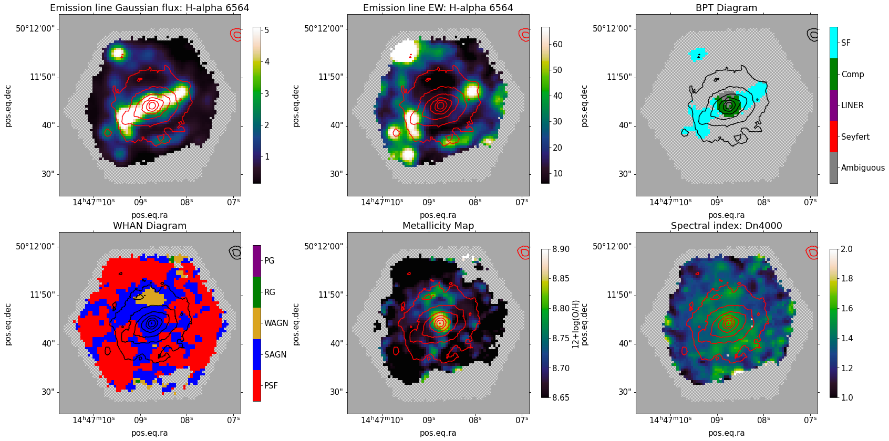
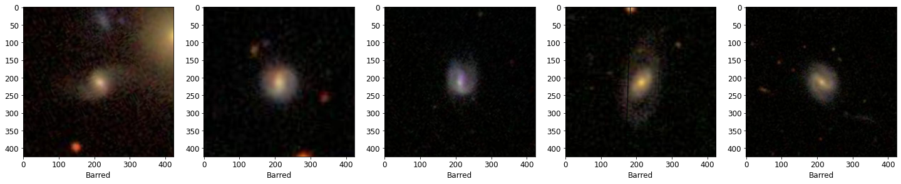
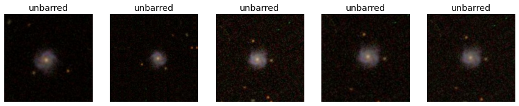
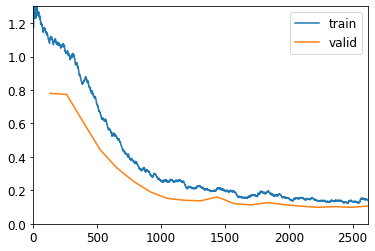
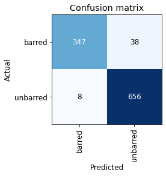

# Jupyter Notebooks for Data Driven Astronomy

## Introduction

With services such as [Google Colab](https://colab.research.google.com/notebooks/intro.ipynb?utm_source=scs-index), [Binder](https://mybinder.org/), and [Gradient](https://gradient.run/notebooks), now Jupyter notebooks can be hosted and shared online. Users can run shared notebooks without having to install required packages locally on their machines. Although these services come with many pre-installed packages, some newer packages require manual installation routines. 

This repository contains codes for the following:

*  H alpha Map, WHAN Map, BPT Map and Metallcity Map overplotted with SDSS g band contours
*  Fast.ai CNN Classifier using Galaxy Zoo Kaggle dataset
*  PSF Simulator

## Notebooks

* Marvin : [ScienceExercises.ipynb](https://github.com/Jack3690/Kugelblitz/blob/main/ScienceExercises.ipynb)
* Fast.ai : [Bar_Classifier.ipynb](https://github.com/Jack3690/Kugelblitz/blob/main/Bar_Classifier.ipynb)
* PSF Simulator : [PSF_Simulator.ipynb](https://github.com/Jack3690/Kugelblitz/blob/main/PSF_Simulator.ipynb)

## Usage
### [ScienceExercises.ipynb](https://github.com/Jack3690/Kugelblitz/blob/main/ScienceExercises.ipynb) 
This notebook can be used to generate Marvin maps with optical contour overplots using Plateifu of MaNGA sources. An example of maps is given below 

 

### [Bar_Classifier.ipynb](https://github.com/Jack3690/Kugelblitz/blob/main/Bar_Classifier.ipynb) 
This notebook contains code for creating a Convolution Neural Network based image classifier for classifying galaxies into Barred or Unbarred using [fast.ai](https://www.fast.ai/). The notebook uses Kaggle Galaxy Zoo dataset for training.

#### Barred 
 

#### Unbarred 
 

The example uses CNN model with **ResNet50** architecture with pretrained weights. Following data augmentation methods are used:

* Rotation : 0 to 360
* Flip : Horizontal and vertical
* Contrast : 0.75 to 1.35
* Zoom : 0.8 to 1.2

#### Data Augmentation*
 
#### Training

#### Confusion Matrix

## Conclusion/Disclaimer

If you have any questions or suggestions for improvements to this repo,
please contact the owners of the  repository.

This is not an official Google product.

## References
* [SDSS-Marvin](https://sdss-marvin.readthedocs.io/en/latest/index.html)
* [MaNGA](https://www.sdss.org/surveys/manga/)
* [fast.ai](http://fast.ai/)
